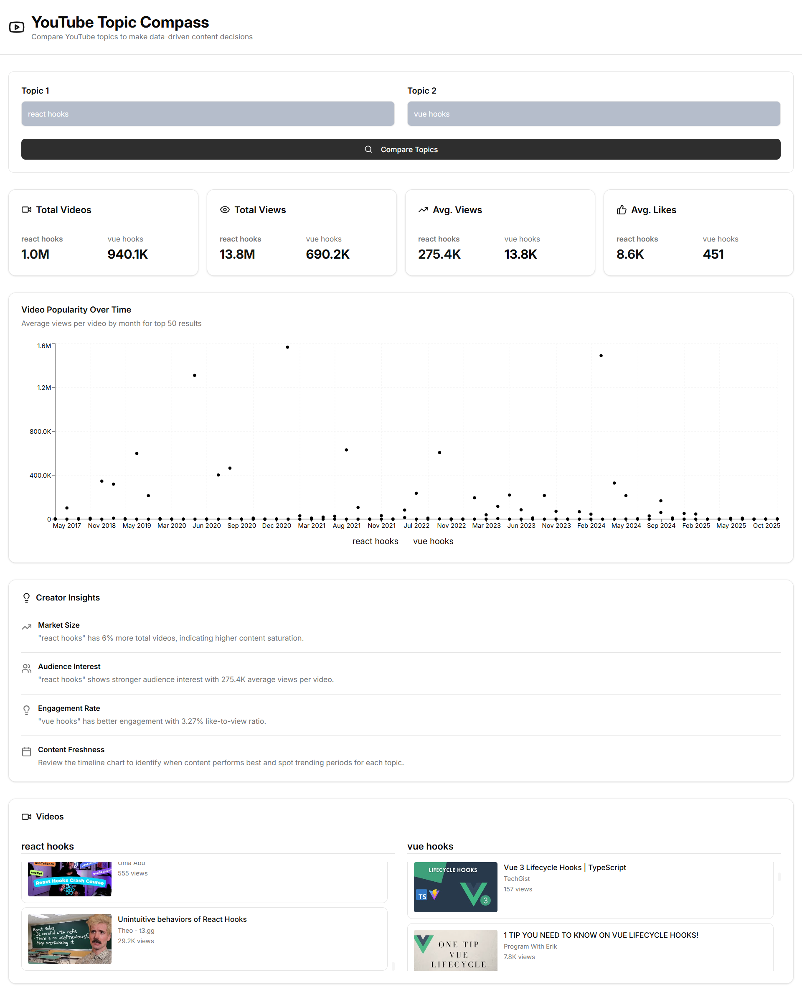

# YouTube Topic Compass

A comprehensive analytics tool for YouTube content creators to compare topics and make data-driven decisions about their content strategy.


## Overview

YouTube Topic Compass helps content creators analyze and compare two YouTube search terms to understand:

- Market saturation (total number of videos)
- Audience interest (view counts and engagement)
- Content performance over time
- Engagement rates and trends

## Features

- 🚀 Server-side rendering
- ⚡️ Hot Module Replacement (HMR)
- 📦 Asset bundling and optimization
- 🔄 Data loading and mutations
- 🔒 TypeScript by default
- 🎉 TailwindCSS for styling
- 📖 [React Router docs](https://reactrouter.com/)

- **Dual Topic Comparison**: Compare any two YouTube topics side-by-side
- **Comprehensive Metrics**:
  - Total video count for each topic
  - Total and average view counts
  - Total and average like counts
  - Engagement rate analysis
- **Timeline Visualization**: Interactive chart showing video popularity over time
- **Creator Insights**: AI-generated insights to help you choose the best topic
- **Modern UI**: Clean, responsive design built with React and Tailwind CSS

## Setup Instructions

### Prerequisites

- Node.js (v20 or higher recommended)
- npm or yarn
- YouTube Data API v3 key

### Getting Your YouTube API Key

1. Go to [Google Cloud Console](https://console.cloud.google.com/)
2. Create a new project or select an existing one
3. Enable the YouTube Data API v3
4. Create credentials (API Key)
5. Copy your API key

### Installation

1. Clone the repository:

```bash
git clone <YOUR_GIT_URL>
cd <YOUR_PROJECT_NAME>
```

2. Install dependencies:

```bash
npm install
```

3. Configure your API key:

Create a `.env` file in the root directory:

```bash
cp .env.example .env
```

Edit the `.env` file and add your YouTube API key:

```
VITE_YOUTUBE_API_KEY=your_youtube_api_key_here
```

Alternatively, you can directly edit `src/config/youtube.ts` and replace the API key constant (not recommended for production).

4. Start the development server:

```bash
npm run dev
```

5. Open your browser and navigate to `http://localhost:3000`

## Technical Choices

### Frontend Architecture

- **React 19** with TypeScript for type safety and modern React features
- **Vite** for fast development and optimized builds
- **Tailwind CSS** with shadcn/ui components for consistent, beautiful UI
- **Recharts** for data visualization

### API Integration

- Direct YouTube Data API v3 integration using fetch API
- Asynchronous data fetching with proper error handling
- Service layer pattern for clean separation of concerns

### Data Processing

- Client-side aggregation of YouTube data
- Efficient parallel API calls for better performance
- Time-based data grouping for cleaner visualizations

### State Management

- React hooks (useState, useEffect) for local state
- React Query for potential future server state management
- Toast notifications for user feedback

## Design Decisions

1. **Client-Side Processing**: All data fetching and aggregation happens in the browser for simplicity and to avoid backend infrastructure costs.

2. **Service Layer**: YouTube API logic is encapsulated in a dedicated service class for maintainability and testability.

3. **Component Architecture**: Small, focused components (SearchInputs, MetricsComparison, TimelineChart, InsightsPanel) for reusability and clarity.

4. **Visualization Strategy**: Monthly aggregation of video data to avoid overcrowded charts while maintaining meaningful insights.

5. **Semantic Design System**: All styling uses CSS variables and Tailwind's semantic tokens for consistent theming and dark mode support.

## Challenges & Future Improvements

### Challenges Faced

- **API Quota Limits**: YouTube API has daily quota limits; careful optimization was needed to minimize API calls
- **Data Normalization**: Handling varying date ranges and video counts across different topics
- **Performance**: Processing 50 videos × 2 topics efficiently without blocking the UI

### Potential Improvements

1. **Caching Layer**: Implement local storage caching to reduce repeated API calls
2. **Advanced Filtering**: Add filters for date ranges, video duration, and channel types
3. **Export Functionality**: Allow users to export comparison data as CSV or PDF
4. **Batch Comparisons**: Support comparing more than 2 topics simultaneously
5. **Trending Detection**: Add algorithm to detect trending topics and optimal posting times
6. **Backend Integration**: Move API calls to a backend service for better security and rate limiting
7. **Historical Data**: Track and compare how topics trend over longer periods

## Project Structure

```
app/
├── components/          # React components
│   ├── ui/             # shadcn/ui base components
│   ├── SearchInputs.tsx
│   ├── MetricsComparison.tsx
│   ├── TimelineChart.tsx
│   └── InsightsPanel.tsx
├── config/             # Configuration files
│   └── youtube.ts      # YouTube API configuration
├── services/           # Service layer
│   └── youtubeService.ts
├── types/              # TypeScript type definitions
│   └── youtube.ts
└── routes/              # Page components
    └── index.tsx       # Main application page
```

## Technologies Used

- **React** - UI framework
- **TypeScript** - Type safety
- **Vite** - Build tool
- **Tailwind CSS** - Styling
- **shadcn/ui** - Component library
- **Recharts** - Data visualization
- **date-fns** - Date formatting
- **Lucide React** - Icons

## Deployment

### Docker Deployment

To build and run using Docker:

```bash
docker compose up --build

## or
docker build -t trend-spotter .
# Run the container
docker run -p 3000:3000 trend-spotter
```

The containerized application can be deployed to any platform that supports Docker, including:

- AWS ECS
- Google Cloud Run
- Azure Container Apps
- Digital Ocean App Platform
- Fly.io
- Railway

## License

This project was built as a technical demonstration.

## Support

For issues or questions, please refer to the [YouTube Data API documentation](https://developers.google.com/youtube/v3).
